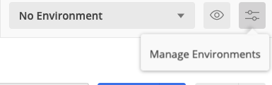
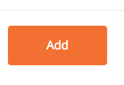
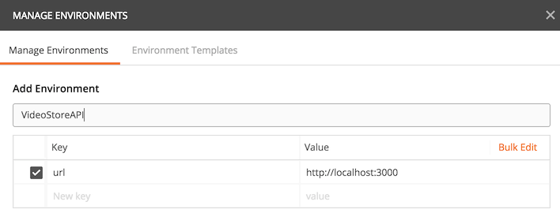

# Project: VideoStoreAPI
The goal of this project is to create a system that a video store (remember those?) could use to track their inventory of rental videos and their list of customers.

We will use Rails to construct a RESTful API. The purpose of this API is to quickly serve information about the store's video collection, customer information, and to update rental status. This repository provides two JSON datafiles to serve as the initial seeds for this system.

This is a pair project. You and your partner should use all the techniques we've learned so far to keep yourselves organized and on track, and ensure that no requirements slip through the cracks.

## Learning Goals
Upon completing this project, students should be able to:

- Build an ERD and set up ActiveRecord models for a given dataset / use-case
- Expose database contents through a web API
- Respond reasonably to bad user data in the context of an API
- Verify the correctness of an API using controller tests

This is a [stage 2](https://github.com/Ada-Developers-Academy/pedagogy/blob/master/rule-of-three.md) project.

## Success Criteria
Your project will be evaluated against the following requirements:

- API conformance
  - The provided smoke tests should pass (see the subfolder)
  - Bad data sent to the API should result in an appropriate status code and helpful error
- Test coverage
  - Models: All relations, validations, and custom model methods should include at least one positive and one negative test case
  - Controllers: Every API endpoint should include at least one positive and one negative test case
- Style and Organization
  - Business logic should be live in models

## Project Baseline
- Read the API Requirements below and create a pseudo-code "routes" file that specifies
  - The _endpoints_ your API will need
  - The _HTTP verbs_ each endpoint will use
  - Any data that must be provided to the endpoint in order for it to do its work
- Read the Seed Data description below and, bearing in mind the API Requirements, create an ERD for your database that specifies
  - The _models_ your database will require
  - The _attributes_ for each model
  - Any _relationships_ between models
- Create a new Rails app to serve as the API
  - **Create the rails app with:** `$ rails new . --api`
- Create a route that responds to `/zomg` that serves a json-encoded "it works!"

## Wave 1: Database Models, Tables, & Seeds
- Generate Rails models and associations to match your ERD
- Use the provided seed script `db/seeds.rb` to import the provided JSON data into your database

### Seed Data
`movies.json` contains information about the videos available to rent at the store. The data is presented as an array of objects, with each object having the following key-value pairs:

| Field          | Datatype | Description
|----------------|----------|------------
| `title`        | string   | The title of the film
| `overview`     | string   | A short plot synopsis
| `release_date` | string   | `YYYY-MM-DD`, Day the film was originally released
| `inventory`    | integer  | How many copies of the film the video store owns

`customers.json` contains information about the customers that have rented with the store in the past. The data is presented as, you guessed it, an array of objects, with each object have the following key-value pairs:

| Field            | Datatype | Description
|------------------|----------|------------
| `name`           | string   | The customer's name
| `registered_at`  | string   | `Wed, 29 Apr 2015 07:54:14 -0700`, When the customer first visited the store
| `address`        | string   | Street address
| `city`           | string   | &nbsp;
| `state`          | string   | &nbsp;
| `postal_code`    | string   | &nbsp;
| `phone`          | string   | Primary contact phone number

### Testing
As with all Rails projects, model testing is a requirement. You should have _at least_ one positive and one negative test case for each relation, validation, and custom function you add to your models.

Use good TDD practices, and test _before_ you code. Remember: red-green-refactor.

## Waves 2 Coding The API
In this wave, you will implement the API described below. The endpoints are described more-or-less in order of complexity, and we recommend you build them in that order. Every endpoint must serve JSON data, and must use HTTP response codes to indicate the status of the request.

The schema of your database and the structure of your rails app are completely up to you, so long as the API conforms to the description and provided script.

### Error Handling
If something goes wrong, your API should return an appropriate [HTTP status code](http://billpatrianakos.me/blog/2013/10/13/list-of-rails-status-code-symbols/), as well as a list of errors. The list should be formatted like this:

```json
{
  "errors": {
    "title": ["Movie 'Revenge of the Gnomes' not found"]
  }
}
```

All errors your API can return should be covered by at least one test case.

### Testing
Because APIs are often open to the public, thorough testing is essential. For a Rails API, that means controller testing.

For each API endpoint, you should have _at least_:
- A basic test with no parameters, if applicable
- Positive and negative tests for any URI parameters (user ID, movie title)
- Testing around any data in the request body

Use good TDD practices, and test _before_ you code. Remember: red-green-refactor.

#### Smoke Tests
Because this API will be used as the backend for a future project, there are strict requirements about how it should be structured. To this end, we have provided a set of [smoke tests](http://softwaretestingfundamentals.com/smoke-testing/) written in Postman to exercise all the endpoints.

The smoke tests will verify that your API looks correct to the outside world, by sending actual HTTP requests to your running server and checking the results. They test things like:

- Did I get a success response for a valid request?
- Did the API return JSON?
- Does the JSON contain the expected property names?

**The smoke tests are not a substitute for writing your own tests!!!!!** They do **not** check that the content is _correct_, nor do they cover any negative or edge cases. Verifying correctness in these cases is **your** responsibility.

The smoke tests live in the file [`test/VideoStoreAPI_smoke_tests.postman_collection.json`](test/VideoStoreAPI_smoke_tests.postman_collection.json). To run them:

1. Open Postman
1. Click `Import` in the top left
1. Drag-and-drop the file into the box
1. In the left sidebar, click on the `Collections` tab
1. There should now be an entry for the smoke tests. Hover over it and click the `>` icon for a detail view.  You will notice they are in the format `{{url}}/movies`.  `{{url}}` is a key which you can give a value on your computer.  
1.  To do so go to the Gearbox in the top-right and select `Manage Environments`  

1.  Then Select `Add` 

1.  Lastly add a key `url` and value `http://localhost:3000` 

1. Click the blue `Run` button. This will launch the collection runner.
1. In the collection runner, scroll down in the center pane and click the blue `Start Test` button

## API Description

#### `GET /customers`
List all customers

Fields to return:
- `id`
- `name`
- `registered_at`
- `postal_code`
- `phone`
- `movies_checked_out_count`
  - This will be 0 unless you've completed optional requirements

#### `GET /movies`
List all movies

Fields to return:
- `title`
- `release_date`

#### `GET /movies/:title`
Look a movie up by `title`

URI parameters:
- `title`: Movie title (e.g. `Jaws`)

Fields to return:
- `title`
- `overview`
- `release_date`
- `inventory` (total)
- `available_inventory` (not currently checked-out to a customer)
  - This will be the same as `inventory` unless you've completed the optional endpoints.

### Optional Rentals

Wave 2 focused on **reading** data from the API.  In these endpoints you will interact with the API changing models through POST requests.  

#### `POST /rentals/:title/check-out`
Check out one of the movie's inventory to the customer. The rental's check-out date should be set to today.

**Note:** Some of the fields from wave 2 should now have interesting values. Good thing you wrote tests for them, right... right?

URI parameters:
- `title`: Movie title (e.g. `Jaws`)

Request body:

| Field         | Datatype            | Description
|---------------|---------------------|------------
| `customer_id` | integer             | ID of the customer checking out this film
| `due_date`    | string `YYYY-MM-DD` | When should this movie be checked back in?

#### `POST /rentals/:title/check-in`
Check in one of a customer's rentals

Request body:

| Field         | Datatype | Description
|---------------|----------|------------
| `customer_id` | integer  | ID of the customer checking in this film

#### `GET /rentals/overdue`
List all customers with overdue movies

Fields to return:
- `title`
- `customer_id`
- `name`
- `postal_code`
- `checkout_date`
- `due_date`

## Going Further
These really are **optional** - if you've gotten here and you have time left, that means you're moving speedy fast!

### Query Parameters
Any endpoint that returns a list should accept 3 _optional_ [query parameters](http://guides.rubyonrails.org/action_controller_overview.html#parameters):

| Name   | Value   | Description
|--------|---------|------------
| `sort` | string  | Sort objects by this field, in ascending order
| `n`    | integer | Number of responses to return per page
| `p`    | integer | Page of responses to return

So, for an API endpoint like `GET /customers`, the following requests should be valid:
- `GET /customers`: All customers, sorted by ID
- `GET /customers?sort=name`: All customers, sorted by name
- `GET /customers?n=10&p=2`: Customers 10-19, sorted by ID
- `GET /customers?sort=name&n=10&p=2`: Customers 10-19, sorted by name

Of course, adding new features means you should be adding new controller tests to verify them.

Things to note:
- Sorting by ID is the rails default
- Possible sort fields:
  - Customers can be sorted by `name`, `registered_at` and `postal_code`
  - Movies can be sorted by `title` and `release_date`
  - Overdue rentals can be sorted by `title`, `name`, `checkout_date` and `due_date`
- If the client requests both sorting and pagination, pagination should be relative to the sorted order
- Check out the [will_paginate gem](https://github.com/mislav/will_paginate)

### More Endpoints: Inventory Management
All these endpoints should support all 3 query parameters. All fields are sortable.

#### `GET /movies/:title/current`
List customers that have _currently_ checked out a copy of the film

URI parameters:
- `title`: Movie title (e.g. `Jaws`)

Fields to return:
- `customer_id`
- `name`
- `postal_code`
- `checkout_date`
- `due_date`

#### `GET /movies/:title/history`
List customers that have checked out a copy of the film _in the past_

URI parameters:
- `title`: Movie title (e.g. `Jaws`)

Fields to return:
- `customer_id`
- `name`
- `postal_code`
- `checkout_date`
- `due_date`

#### `GET /customers/:id/current`
List the movies a customer _currently_ has checked out

URI parameters:
- `id`: Customer ID

Fields to return:
- `title`
- `checkout_date`
- `due_date`

#### `GET /customers/:id/history`
List the movies a customer has checked out _in the past_

URI parameters:
- `id`: Customer ID

Fields to return:
- `title`
- `checkout_date`
- `due_date`
 

# Reference
- [Postman on Environments](https://www.getpostman.com/docs/environments)  
	